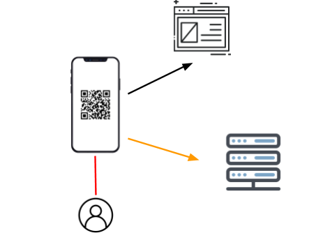

# Website

```
 .          .x+=:.
 .xnnx.  .xx.                     @88>       z`    ^%    .uef^"
 .f``"888X< `888.     x.    .       %8P           .   <k :d88E              u.    .d``
 8L   8888X  8888   .@88k  z88u      .          .@8Ned8" `888E        ...ue888b   @8Ne.   .u
 Xh.  `8888  X888k ~"8888 ^8888    .@88u      .@^%8888"   888E .z8k   888R Y888r  %8888:u@88N
 '8   '8888  X8888   8888  888R   ''888E`    x88:        888E~?888L  888R I888>   `888I  888.
 `*  '8888  X8888   8888  888R     888E     8888N=*8888  888E  888E  888R I888>    888I  888I
 `!  X888~  X8888   8888  888R     888E             R88  888E  888E  888R I888>    888I  888I
 -`  X*"    X8888   8888 ,888B .   888E       @8Wou 9%   888E  888E u8888cJ888   uW888L  888'
  xH88hx .8X8888  "8888Y 8888"    888&     .888888P`    888E  888E  "*888*P"   '*88888Nu88P
 *"*888888~ X888X   `Y"   'YP      R888"    `   ^"F     m888  888>    'Y"    ~ '88888F`
 `   "8%    X888>                   ""                   `Y"   888               888 ^
  .x..     888f                                                 "               *8E
 88888    :88f                                                                  '8>
 "88*"_..x8*~                                                                     "


```

**Yui** ❤


Build in progress **v0.9**
- Bref trêve de plaisanterie, on passe aux choses sérieuses

# Le site web
> oui c'est un site web au cas où tu n'ait pas lu le titre

## Le site
- Le site est un site de vente conçu à la base pour de la vente de produits en ligne. Ainsi que de la possible mise en place d'un système click and collect. 
Le site est actuellement en cours de création est donc peut réagir de manière improbable dans certaines situations. (Improbable du genre répondre avec des pages que nous n'avons pas développés. À se demander si y a pas un fantôme sur notre serveur de test.)

## Les systèmes inclus
### Espace membres
- L'espace membres est actuellement en cours de développement. Celui-ci permet au client de pouvoir directement stocker des informations de manière à pouvoir les réutiliser lors de leurs prochaines visites / commandes. On précise que tous les utilisateurs ne sont pas forcément des clients.

### Espace de vente
- Un moteur de recherche est disponible. Il permet au client de pouvoir rechercher des produits par filtres. Il permet au(x) vendeur(s) de pouvoir définir une suite de filtres en rapport avec la liste de produits disponibles sur le site. 
> Y a peut-être un easter eag par là mais faut aller voir le code pour le trouver !

### Espace de login/register


- Nous savons qu'un mot de passe peut être une difficulté pour certains utilisateurs. Ainsi, pour leur simplifier la vie tout en leur sécurisant leurs données personnelles, nous leur proposons un système complet de login par QR code.
- Nous ne sommes pas suffisamment compétents pour pouvoir développer un espace de login normal sans option chelou. Nous nous excusons.

### Espace administrateur
- L'espace administrateur permet la mise en place d'une équipe afin de pouvoir travailler sur les sites web et ses analyses.
> le site contient comme sur Linux, un compte en **god mode** qui peut tout faire.

## Les fonctionnalités
### Configuration du site
- Le site est capable de s’adapter entièrement depuis un fichier "*config.json*". Depuis ce même fichier, on peut personnaliser son site à son bon vouloir.
- Dans une future mise à jour il sera possible d'accéder à plusieurs sites web et de les gérer avec un fichier *config.json* par URL.
(Le panel administrateur sera le même pour tous les sites).
- Comme cela le jour où vous voulez ouvrir un shop de vente de produits et que vous avez clairement la flemme de le faire, il vous suffit de configurer un multisite et le script s'en charge pour vous ! Il ne vous reste plus qu'à trouver les images !

### Hébergement
- Afin d'être mis en ligne, la configuration du serveur dédié est nécessaire. Pour des questions évidentes de failles de sécurité, le serveur doit être un serveur Linux Ubuntu 18.04.5 / 20.04 ou Debian serveur.
- Le serveur de base de données est un serveur MySQL. Il répond exactement aux besoins du site.
- Pour une mise en place d'un concurrent d'Amazon, nous vous conseillons une réorientation professionnelle

### Le code du site 
- Le site répond au classique système de page web. Il est constitué de code *html, css, js*. Sa modification est donc simple et accessible. (LOL)
- Le système de gestion de requête et de traitement de données est réalisé avec le système **Deno**. (Soit prêts à perdre ton temps à patch des bugs qui ne sont pas dans le même fichier qui est indiqué dans la console.)
- Les dossiers / fichiers du site sont de préférence à ne pas toucher (sauf pour les développeurs **aguéris**, le pêre noel, Yui, Elon musk, et tout les gens en manque de vie sociale). Le dossier “*files*” permet de stocker le contenu comme les images ou autre type de documents permettant la configuration faite dans le(s) fichier(s) “*config.json*”.

### Outils d'analyse et de suivi
- Pour une utilisation de Deno nous recommendons l'utilisation de PM2 en tant qu'outils d'analyse. 
- Après si t'est vraiment un pro, t'en a pas besoin. Le site marche comme sur des roulettes. (de cadi un dimanche matin)

### Sécurité du site 
- La sécurité des données des utilisateurs est primordiale. C’est pourquoi nous avons opté pour la mise en place de technologies les plus sûres et sécurisées actuellement disponible.
- Nous vous demandons de ne pas lire la liste ci-dessous.
- [x] Toutes les données sont stockées dans une base de donnée dont l'identifiant est *bien évidement* sécurisé
- [x] Toutes les données sensible tel que les mots de passe sont stockées avec le chiffrement sha512
- [x] Le serveur d'hébergements utilise un système UNIX (à éviter: windobe serveur)
- [x] Utilisation de Deno pour la gestion et le traitement des requêtes.
- [x] Analyse du trafic également réalisé avec Deno.
- [x] Deno filtre les accès via Tor browser pour sécuriser vos données. Ce paramètre n'est pas encore configurable.
- [x] Pourquoi tu as lu cette liste ?

# Les Fichiers

```md
\--|assets\
\--|files\
\--|website\
\--|website\about\
\--|website\add_key\
\--|website\add_phone\
\--|website\admin\
\--|website\c&c\
\--|website\files\
\--|website\home\
\--|website\liste_produit
\--|website\login_register\
\--|website\produits\
\--|website\users\

```
*seul le dossier **files** peut etre utilisé par un utilisateur lambda*
> ne peux pas être developpé ici. 

# Fonctionnalitées

## Espace de travail pour: V 0.1-0.5
### Espace client
- [x] Login
- [x] Register
- [ ] Gestion de compte
- [x] Gestion de panier
- [ ] Espace de paiment

### Espace vendeur
- [x] Gestion des nouveaux produits
- [ ] Statistique des produits
- [ ] Gestion de paiement

### Administrateurs
- [ ] Statistique complète du site
- [x] Accès aux données de vente
- [ ] Modification de `config.json`

# Le service Deno

## 1 Le sytème de requête: 
> Le système complet est controlé par le runtime Deno :p 

```ts
import { server } from "https://deno.land/std@0.76.0/http/server.ts";
const serve = server({ port: 8000 });
 
console.log("Site web en ligne sur: http://localhost:8000/");

for await (const requette of serve) {
   requette.respond({ body: "Hello World" });
}
```

## La détection de Tor Browser:
- L'algo est basé sur le git suivant: https://github.com/DrBlackWolf27/analyse_user_agent
- Il est basé sur les User-Agent

# Installation du site web:

- [ ] Deno runtime
- [ ] Mysql serveur
- [ ] Site

## Deno

### Installation de deno
Installation de deno:
**Shell (Mac, Linux):**
`curl -fsSL https://deno.land/x/install/install.sh | sh`

**PowerShell (Windows):**
`iwr https://deno.land/x/install/install.ps1 -useb | iex`

> Pour linux, afin de créer la commande deno:
```sh
nano /home/username/.profile
```
> à la fin du fichier rajouter:
```sh
export DENO_INSTALL="/home/username/.deno"
export PATH="$DENO_INSTALL/bin:$PATH"
```
> après avoir enregistré
```sh
source /home/username/.profile
```

### Utilisation de deno
- Commandes de base:
`deno run monfichier.ts`

- Pour permettre l'utilisation des bonnes ressources, nous avons besoin de:
`--allow-read --allow-write --allow-net`
Afin que le script puisse lire, écrire, et accéder au port web

- La commande finale pour lancer le code est donc:
`deno run --allow-read --allow-write --allow-net main.ts`

- [x] *Deno*
## Installation de mysql
- Libre a vous d'installer MYSQL comme il se doit.
Afin de faire fonctionner correctement le site, les identifiants de la base de données doivent être renseignés dans le fichier
`/assets/database/config.json`
```json
{
  "hostname": "127.0.0.1",
  "username": "USERNAME_BDD",
  "db": "NOM_TABLE",
  "password": "MOT_DE_PASSE_USER"
}
```
- [x] *Mysql*

## Installation du site

### Manuelle:
- Exécuter le code suivant dans une invite de commande, dans le dossier parent du site.
``deno run --allow-read --allow-write --allow-net main.ts`

###  PM2
- Afin de pouvoir utiliser le script de manière professionnelle, il est possible d'utiliser le module PM2
- installation de **NODEJS**: https://nodejs.org/en/download/
- installation de **PM2**: https://pm2.keymetrics.io/docs/usage/quick-start/

> l'installation ne peux pas être detaillé ici

- commande finale pour lancer en arrière plan avec PM2
`pm2 start main.ts --interpreter="deno" --interpreter-args="run  --allow-read --allow-write --allow-net" `


# Maj possible:
Idées probable | Idées en cour de reflexion
------------ | -------------
Récupération de mot de passe  | Mise en place d'un support
xx | Vente d'espace de produits

# Les contributeurs au projet: 
1. @DrBlackWolf27 - contributeur Deno + bases de données
2. @ethanM31 - contributeur front-end + purge du code
3. @GhostRileyBG - contributeur front-end + bases de données

- Nous ne vous encourageons en aucun cas a l'utilisation de cet outil pour la mise en place de services illicites. Les auteurs de Yui Shop ne peuvent être tenu pour responsable de l'utilisation de cet outil.

# Documentations

### Liens
1. **[:p]** Documentation du service Deno: https://deno.land
2. **[:p]** Documentation du service NodeJs: https://nodejs.org/en/download/
3. **[:p]** Documentation du service PM2: https://pm2.keymetrics.io/docs/usage/quick-start/

### Logos


